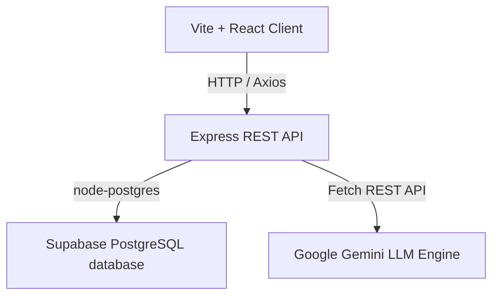
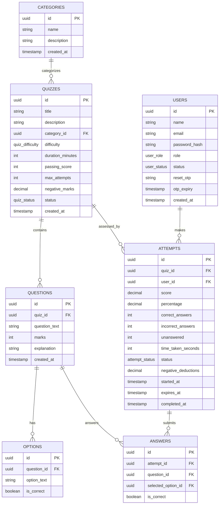

# ⚡ Quizverse: Role-Based Assessment Engine

Quizverse is a state-of-the-art, premium role-based online assessment and examination system. Built with modern web technologies, it features an interactive admin dashboard, real-time analytics, automated student leaderboards, and an AI-powered question generator.

---

## 🚀 Tech Stack


---

## 📐 System Architecture

The project is split into a modular backend and component-driven frontend:



### Backend Structure
*   `server.js`: API entry point and global middleware configuration.
*   `config/db.js`: PostgreSQL connection pool setup.
*   `controllers/`: Requests routing and database query execution.
*   `routes/`: API endpoint definition wrappers.
*   `middleware/`: Authentication guards (`authenticateToken`) and privilege validation (`requireRole`).

---

## 📊 Database Entity-Relationship (ER) Diagram



---

## 🔑 Environment Variables Setup

### Backend Config (`backend/.env`)
Create a file named `.env` in the `backend/` folder:
```env
PORT=5000
DATABASE_URL="your-postgresql-connection-string"
JWT_SECRET="your-jwt-signing-secret"
ADMIN_SECRET_KEY="QUIZVERSE_ADMIN_SECRET_2026"
GEMINI_API_KEY="optional-google-gemini-api-key"
```

### Frontend Config (`frontend/.env`)
Create a file named `.env` in the `frontend/` folder:
```env
VITE_API_BASE_URL="http://localhost:5000/api"
```

---

## 📑 REST API Endpoint Reference

### Authentication (`/api/auth`)
*   `POST /register`: Register a new user account.
*   `POST /login`: Log in and receive a JWT token.

### Categories (`/api/categories`)
*   `GET /`: Retrieve all categories (Students & Admins).
*   `POST /`: Create a new category (Admin only).
*   `DELETE /:id`: Delete a category (Admin only).

### Quizzes (`/api/quizzes`)
*   `GET /`: Fetch quizzes (Students see published only; Admins see all).
*   `POST /`: Create a new draft quiz (Admin only).
*   `PATCH /:id/publish`: Change quiz publication status (Admin only).
*   `DELETE /:id`: Delete a quiz (Admin only).

### Questions (`/api/questions`)
*   `GET /quiz/:quizId`: Get questions for a quiz (Student requests have the `is_correct` answers redacted).
*   `POST /`: Add a question with options (Admin only).
*   `DELETE /:id`: Remove a question (Admin only).

### Attempts (`/api/attempts`)
*   `POST /start`: Start a new quiz attempt.
*   `POST /submit`: Submit user selections, compute marks, and save status.
*   `GET /history`: Fetch attempt history for current user.
*   `GET /:id`: Get specific attempt results including question breakdowns.

### Analytics (`/api/analytics`)
*   `GET /admin`: Retrieve general platform analytics cards & categories breakdown (Admin only).
*   `GET /leaderboard`: Get Top 10 rankings sorted by average score (Optionally filterable by `?category_id=...`).

### AI Generator (`/api/ai`)
*   `POST /generate-questions`: Generate questions on a topic (Optionally bulk-inserts directly to `quiz_id`).

---

## 🛠️ Local Setup & Run Guide

### Prerequisite Check
*   Node.js (v18 or higher) installed.
*   PostgreSQL running locally or on a cloud provider like Supabase.

### 1. Database Configuration
Run the schema setup script inside your target database tool (or execute CLI query command):
```bash
psql -d "YOUR_DB_URL" -f backend/scripts/schema.sql
```

### 2. Startup Backend
Navigate to the backend folder, install dependencies, and run:
```bash
cd backend
npm install
npm run dev
```
Backend server starts on `http://localhost:5000`.

### 3. Startup Frontend
Navigate to the frontend folder, install dependencies, and run:
```bash
cd ../frontend
npm install
npm run dev
```
Vite dev server starts on `http://localhost:5173`.
